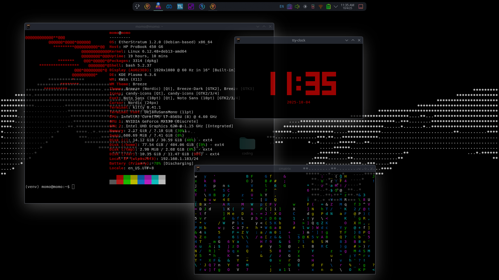

# EtherStratum 🌠

**EtherStratum** (1.2.0 "Danio") is a lightweight, developer-focused Debian-based distribution installer. It’s designed to seamlessly run on **any Debian/Ubuntu-based system**, providing a fully configured desktop, essential development tools, OPSEC utilities, ready to go out-of-the-box.

Whether you’re distrohopping or building a dev workstation, EtherStratum gets you productive fast, without the bloat.

## Whats New?
* Stock DE changed from BSPWM to XFCE
* More aliases added
* Fixed custom fastfetch logo not being properly loaded


---

## 🚀 Features

* **Base:** Debian 13 “Trixie” (Debian-based) (Or use any debian or ubuntu based distro)

* **Desktop Environment:** XFCE4 (KDE also)

* **Filesystem Enhancements:**

  * `/home` – personal files
  * `/var` – system files
  * `/tmp` – temp files (if you already have it the installer wont make it)
  * `/vat` – sandbox for testing scripts or experimental tools

* **Pre-installed Development Tools:**

  * Languages: Python 3, Node.js, Go, Rust, Ruby, Lua
  * Package Managers: pip, npm, cargo, pyenv, venv, nala
  * Editors: VS Codium, Vim, Emacs, Nano
  * Compilation & Build: GCC, Clang, Make, CMake, Build-Essential, Default JDK/JRE
  * Containers & Virtualization: Docker, Podman, QEMU
  * Utilities: Git, curl, wget, tmux, cmatrix, cava, fastfetch

* **OPSEC / Security Tools:**

  * OpenVPN, ProtonVPN, YubiKey Manager, cryptsetup
  * Network analysis: Nmap, Aircrack-ng, Masscan, Metasploit
  * Python security tools: scapy, pwntools, pyopenssl, bcrypt

* **Media & Productivity:**

  * Spotify, Brave, GIMP, Kiwix
  * Cowsay, colorama, rich

* **Installer & Automation:**

  * Single bash script (`install-etherutils.sh`) installs and configures everything
  * Custom aliases & shortcuts for dev productivity
  * Fastfetch integration with custom EtherStratum logo

---

## 📦 Installation

1. Start with any **Debian/Ubuntu-based system** (Netinstall recommended).
2. Download the EtherStratum installer:

```bash
git clone https://github.com/MOHAPY24/EtherStratum.git
cd EtherStratum
chmod +x install-etherutils.sh
sudo ./install-etherutils.sh
```

3. Sit back while the installer sets up your system with **all tools, themes, and aliases**.
4. Reboot and enjoy a fully configured EtherStratum system!

---

## 💻 Why EtherStratum?

* **Cross-Distro Compatibility:** Works on any Debian or Ubuntu derivative
* **Lightweight but Full-Featured:** Optimized KDE, pre-installed dev tools, minimal bloat
* **Sandboxed Testing:** Use `/vat` to test scripts or experimental software safely (TestVat system)
* **Fast & Stable:** Tested even on older hardware; scales well on modern machines
* **OPSEC & Dev Ready:** Security, privacy, and productivity built-in

---

## ⚡ Aliases & Shortcuts

```bash
alias python="python3"
alias ffs="fastfetch"
alias nef="neofetch"
alias vsc="codium"
alias etherstratum="echo EtherStratum v1.1.0"
alias clearvat="sudo rm -rf /vat/*"
```

…plus wayy more pre-configured aliases to streamline your workflow.

---

## 📜 License

EtherStratum is released under the **MIT License**. See `LICENSE` for details.
